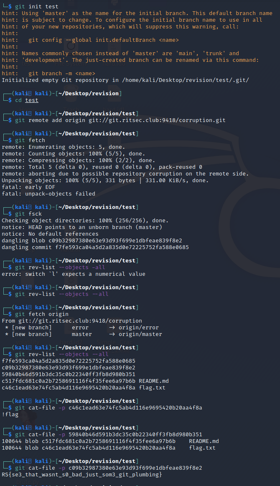

# Corruption - 500
## Solved by: DeadlyKitten
## 55 Solves

> It seems that this remote is somehow corrupted. See if we can somehow get the data...

- When trying to clone the repository we are presented with an error:

- According to DeadlyKitten, you can get around this error by first initializing a repository locally, then adding the corrupt repository as an origin. After this, you can then _fetch_ the repository and begin snooping around. The following picture shows the steps required to get the flag:

